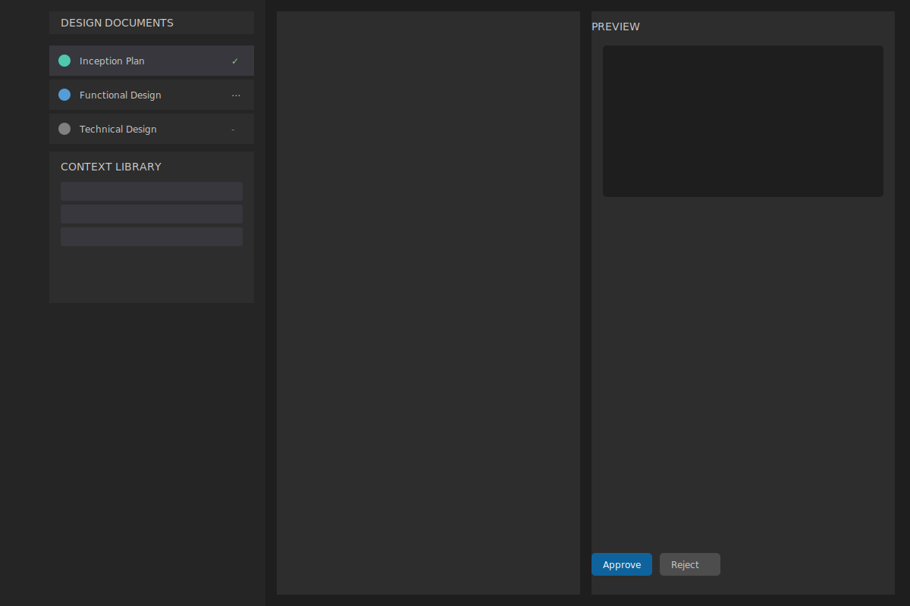
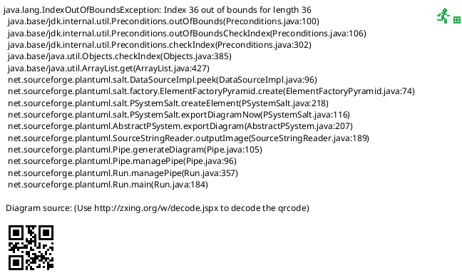
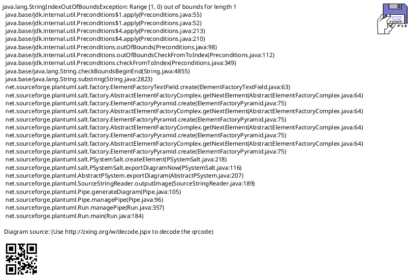
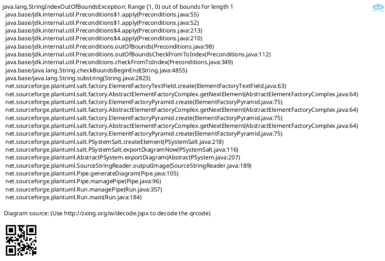

# Visual Studio Code: Roo-Cline Architect Extension

## Overview
An extension that enhances Roo-Cline's capabilities in Visual Studio Code by formalizing and streamlining architectural design workflows for complex software projects.

## Background
Roo-Cline currently provides AI-powered coding assistance through Large Language Models like Claude Sonnet. While powerful for implementation tasks, complex projects benefit from a structured design-first approach before implementation.

## Design Workflow

## Interface Design

### User Interface Components

The extension's interface is designed to integrate seamlessly with Visual Studio Code's existing layout while providing specialized tools for architectural design. The interface follows VS Code's native dark theme and design patterns to maintain a consistent user experience.

The main interface consists of three primary regions: the Document Explorer Panel on the left, the Main Editor in the center, and the Preview Panel on the right. This layout optimizes the workflow for document creation and review while maintaining easy access to project context and resources.

Let's examine each component in detail:

#### Document Explorer Panel
Located on the left side of the interface, the Document Explorer serves as the primary navigation hub for all design documents. The panel presents a clear hierarchical view of project documentation, with each document's status immediately visible through color-coded indicators:

- Green circle with checkmark: Indicates an approved document that has been locked for the next phase
- Blue circle with dots: Shows a document currently in progress or under review
- Gray circle with dash: Represents a pending document that hasn't been started yet

This visual system allows team members to quickly assess the project's progress and identify which documents require attention.

#### Context Library Panel
Positioned below the Document Explorer, the Context Library provides quick access to reusable design elements and project context. The panel features:

- A searchable interface with filtering capabilities
- Collapsible categories for different types of context (architectural patterns, coding standards, configuration templates)
- Drag-and-drop functionality for seamless integration with documents
- Integration with project-specific settings and global templates

The Context Library helps maintain consistency across documents and reduces repetitive work by making commonly used elements easily accessible.

#### Main Editor Area
The central workspace is divided into two synchronized panels that work together to provide a comprehensive editing experience:

Left Panel (Editor):
- Full-featured Markdown editor with syntax highlighting
- Code completion for technical content
- Integrated AI assistance through Roo-Cline
- Support for diagram syntax (Mermaid, PlantUML)

Right Panel (Preview):
- Real-time rendering of Markdown content
- Live diagram previews
- Interactive elements for testing and validation
- Contextual feedback from Roo-Cline

#### Document Controls
The interface includes several control elements strategically placed for efficient workflow management:

- Approval/Rejection buttons at the bottom of the preview panel
- Version control integration in the top bar
- Document status toggles
- Export and sharing options
- Quick access to Roo-Cline assistance

This layout prioritizes efficiency and clarity, allowing developers to focus on document creation while maintaining easy access to all necessary tools and resources. The interface design supports the natural flow of the architectural design process, from initial conception through approval and implementation.

### Interface Interactions

## Features

### Document Management
- Dedicated UI panel displaying document list and status
- Live preview support for Markdown and Mermaid diagrams
- Real-time collaborative editing with AI assistant
- Document version tracking and approval workflow

### Context Management
- Global snippet library for reusable context
- Project-specific context importing
- External resource integration (URLs, files)
- Role-based assistant configurations

### Implementation Integration 
- Automated Git operations
   - Commit generation
   - Branch management
   - Pull request creation
- Integration with Git flow practices
- Enhanced Roo-Cline capabilities for post-design implementation

## Benefits
- Structured approach to complex software design
- Reduced implementation iterations through thorough planning
- Efficient collaboration between developer and AI assistant
- Seamless transition from design to implementation
- Optimized resource usage by breaking down large tasks

## Target Use Cases
- Large codebases requiring architectural planning
- Multi-module projects with complex dependencies
- Team projects needing clear architectural documentation
- Systems with multiple integration points
- Projects requiring extensive technical planning

## Detailed Use Cases

### UC1: Creating a New Design Document

**Primary Actor:** Software Architect/Developer
**Preconditions:** 
- VSCode is open with the Roo-Cline Architect extension
- User has necessary permissions

**Main Flow:**
1. User clicks "New Document" in Document Explorer
2. System presents template selection dialog
3. User selects document type (Inception/Functional/Technical)
4. System loads appropriate template with AI-suggested structure
5. User fills in document content
6. System provides real-time validation and suggestions
7. User reviews and finalizes document
8. System saves and indexes the document

**Alternative Flows:**
- A1: User imports existing document
- A2: User creates document from saved template
- A3: User requests AI to generate initial content

### UC2: Context Library Integration

**Primary Actor:** Software Architect/Developer
**Preconditions:**
- Active document is open
- Context Library is populated

**Main Flow:**
1. User searches Context Library for specific pattern/template
2. System displays matching items with previews
3. User drags selected item to editor
4. System integrates item with current document
5. AI suggests contextual customizations
6. User accepts or modifies suggestions
7. System updates document with integrated content

**Alternative Flows:**
- A1: User creates new context item
- A2: User modifies existing template
- A3: AI suggests relevant patterns

### UC3: Collaborative Review Process

**Primary Actor:** Document Author and Reviewer
**Preconditions:**
- Document is complete and ready for review
- Reviewer has necessary permissions

**Main Flow:**
1. Author submits document for review
2. System performs AI-powered validation
3. Reviewer receives notification
4. Reviewer adds comments and suggestions
5. System notifies author of feedback
6. Author addresses feedback
7. System validates changes
8. Reviewer approves final version

**Alternative Flows:**
- A1: Document requires major revision
- A2: Multiple review cycles needed
- A3: Automated approval for minor changes

### UC4: AI-Assisted Technical Documentation

**Primary Actor:** Technical Writer/Architect
**Preconditions:**
- Project technical requirements are defined
- AI assistant is configured for technical domain

**Main Flow:**
1. User begins technical documentation
2. System provides real-time writing assistance
3. AI suggests relevant technical diagrams
4. User reviews and modifies suggestions
5. System generates visualization code
6. User finalizes documentation
7. System integrates with version control
8. Document is saved and indexed

**Alternative Flows:**
- A1: Import existing technical docs
- A2: Generate documentation from code
- A3: Export to different formats

### UC5: Architecture Pattern Implementation

**Primary Actor:** Software Architect
**Preconditions:**
- Project is in design phase
- Architecture patterns are available in library

**Main Flow:**
1. User selects architecture pattern
2. System loads pattern template
3. User customizes pattern for project
4. AI validates architectural decisions
5. System suggests optimizations
6. User finalizes architecture design
7. System generates implementation scaffold
8. Code structure is created

**Alternative Flows:**
- A1: Custom pattern creation
- A2: Pattern combination
- A3: Legacy system adaptation